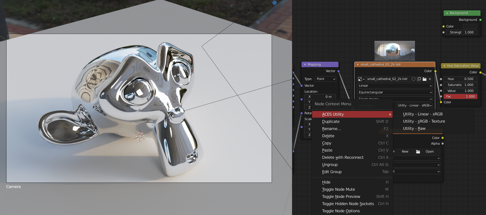

# aces helper [blender addon]

> this is a simple addon for changing colorspace for aces
>
> support cycles and eevee now

## How to use

right click on the **image / environment texture** node to change it to aces color space 

+ for hdr texture, you should choose "Utility - Linear - sRGB"
+ for color texture, you should choose "Utility - sRGB - Texture"
+ for normal/roughtness/metallic/... texture,you should "Utility - Raw"

